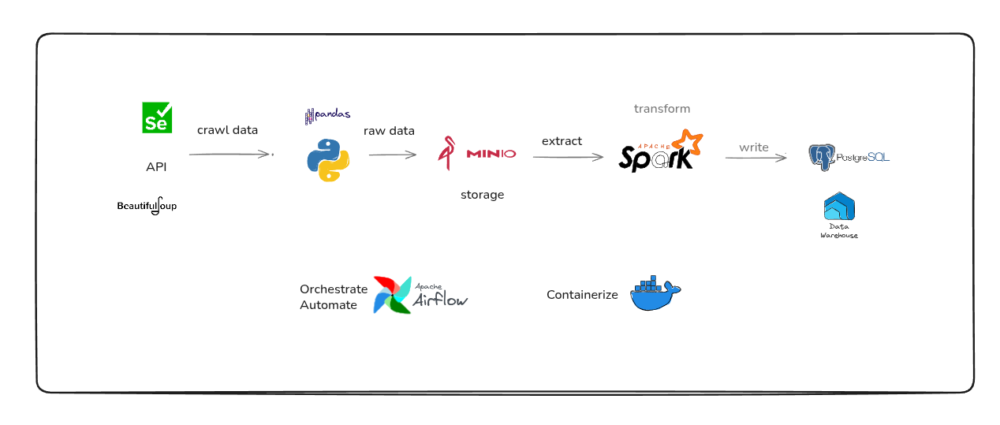
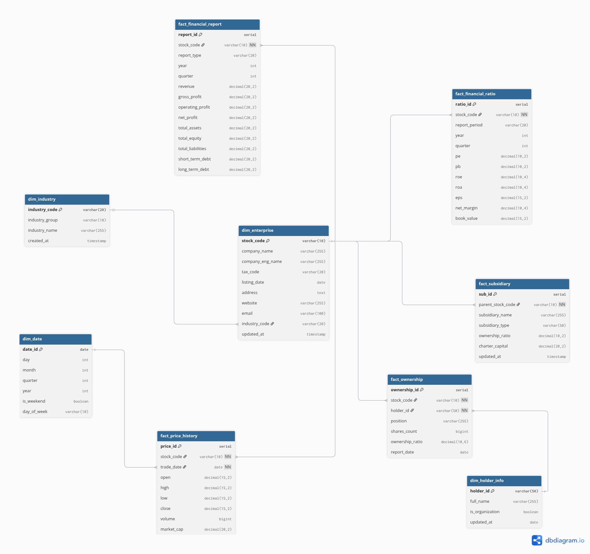
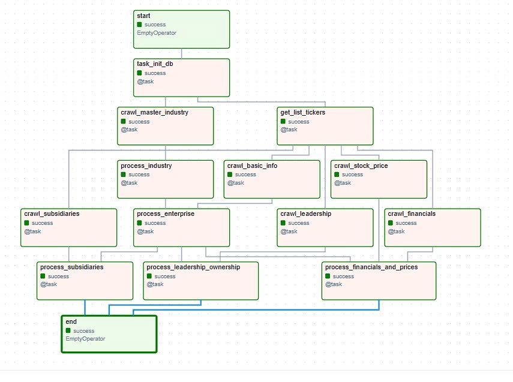

# VN50 Stock Data Pipeline & Data Warehouse

## Project Overview
This project is an end-to-end Data Engineering solution designed to crawl, extract, transform, and load (ETL) comprehensive financial and stock market data for the **Top 50 largest companies by market capitalization in Vietnam (VN50)**. 

The pipeline automatically aggregates scattered data from various financial sources including enterprise profiles, leadership ownership, subsidiary networks, historical stock prices, and core financial reports. The final processed data is stored in a structured Data Warehouse, ready for BI dashboards and financial analytics.

##  Pipeline Architecture
The system follows a robust ETL architecture:
1. **Extract**: Python crawlers (BeautifulSoup/Pandas) fetch raw HTML and API data.
2. **Data Lake (Storage)**: Raw data is ingested into **MinIO** (S3-compatible object storage) in CSV format.
3. **Transform**: **Apache Spark (PySpark)** reads the raw data from MinIO, cleanses it, enforces data types, and applies business logic.
4. **Load**: The processed data is loaded into a **PostgreSQL Data Warehouse**.
5. **Orchestrate**: The entire workflow is managed and scheduled by **Apache Airflow**.



## Data Warehouse Schema (Galaxy Schema)
To handle the complexity of multi-dimensional financial data, the Data Warehouse is modeled using a **Galaxy Schema**

**Key Tables:**
* **Dimensions**: `dim_enterprise`, `dim_industry`, `dim_holder_info`, `dim_date`.
* **Facts**: `fact_price_history`, `fact_financial_ratio`, `fact_financial_report`, `fact_ownership`, `fact_subsidiary`.



## Airflow Orchestration
Apache Airflow acts as the brain of the project, ensuring tasks are executed in the correct order with proper dependency management. 

The DAG (`vn-stock-pipeline-full`) is structured to separate extraction tasks and transformation tasks:
1. Initializes the Database schema.
2. Crawls Master Data (Industries) and the VN50 Ticker list.
3. Executes parallel crawling tasks (Basic Info, Subsidiaries, Leadership, Financials, Price History).
4. Triggers Spark processing tasks only after upstream data is successfully landed in the Data Lake.



## 🛠️ Technologies Used
* **Programming Language:** Python 3.10
* **Extraction / Web Scraping:** `BeautifulSoup4`, `Selenium`, `DrissionPage` `pandas`, `requests`, `vnstock`
* **Data Lake:** MinIO (Local S3-compatible storage)
* **Distributed Processing:** Apache Spark
* **Data Warehouse:** PostgreSQL 
* **Workflow Orchestration:** Apache Airflow 
* **Infrastructure / Containerization:** Docker & Docker Compose

---

## Getting Started

Follow these instructions to set up and run the project on your local machine.

### Step 1: Clone the Repository
Open your terminal and run:

```text
git clone https://github.com/duydua04/VN-STOCK.git
cd VN-STOCK
```

### Step 2: Configure Environment Variables
Copy the provided example file to create your own .env file:
```text
cp .env_example .env
```
Open the .env file and modify the env variables and API key. 

### Step 3: Start the Infrastructure
Build and start all required container in the background:
```text
docker-compose up -d --build
```

### Step 4: Access the Services
Once the containers are up and fully initialized, you can access the web interfaces via your browser:

* **Apache Airflow UI:**
  * **URL:** `http://localhost:8080`
  

* **MinIO Console (Data Lake):**
  * **URL:** `http://localhost:9001`
